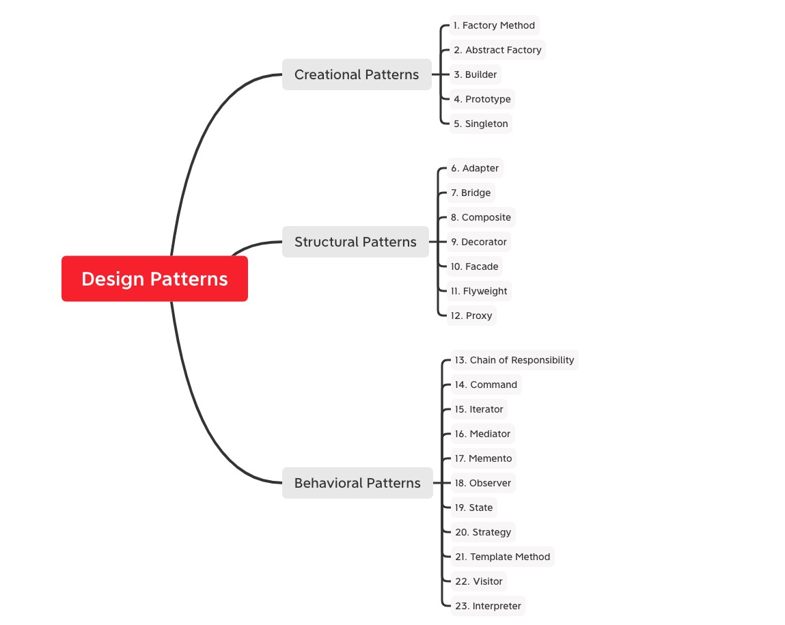

# Knowledge Hierarchy

> Talk is cheap. Show me the code.

A polyglot personal learning monorepo. Each directory is an independent project with its own toolchain.

---

## Code Projects

### Python

| Project | Description |
| --- | --- |
| [interpreter/](interpreter/) | Pascal-style interpreter — lexer → parser → semantic analyzer → tree-walking evaluator |
| [database/](database/) | SQL-ish database engine with transactions, joins, and predicate evaluation |
| [http-server/](http-server/) | Raw socket → WSGI → Flask progression |
| [python/](python/) | Algorithms, machine learning, games (Tetris), Redis, Scapy, SciPy, Protobuf |

### Systems

| Project | Description |
| --- | --- |
| [c/arsenal/](c/arsenal/) | Algorithms & data structures library (Unity test framework) |
| [c/database/](c/database/) | C database walkthrough, tested with RSpec |
| [c/tinyhttpd/](c/tinyhttpd/) | Minimal HTTP server in C |
| [rust/scrape_url/](rust/scrape_url/) | Web scraper with reqwest + html2md |

### Other Languages

| Project | Description |
| --- | --- |
| [go/](go/) | Web framework and examples |
| [design-patterns/](design-patterns/) | Creational, structural, and behavioral patterns in Python |
| [sorting/](sorting/) | Classic sorting algorithm implementations |
| [spark/](spark/) / [kafka/](kafka/) / [scala/](scala/) | Big data stack explorations |
| [javascript/](javascript/) / [java/](java/) / [shell/](shell/) | Language exercises |

---

## Notes & Reference

- [english/](english/) — New Concept English 4, TOEFL sentences
- [big-data/](big-data/) / [mysql/](mysql/) / [linux/](linux/) / [docker/](docker/) / [graphql/](graphql/) — topic notes
- [books/](books/) / [poetry/](poetry/) — reading notes

---

## Design Patterns Overview

